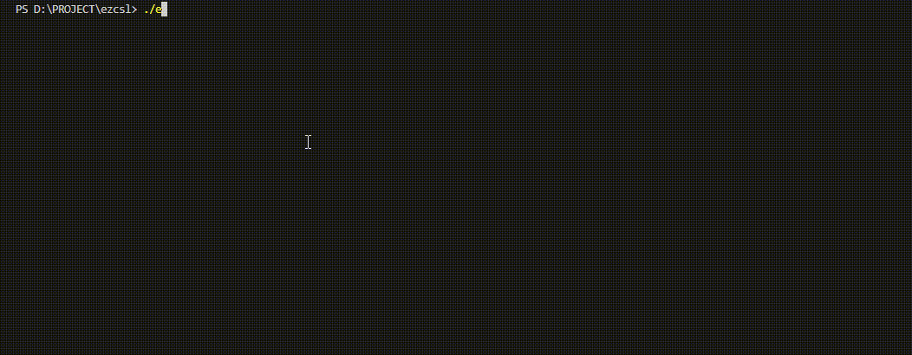

# EzCsl
Ezcsl is a console programming by C ,that can be used for MCU terminal simulation

## Migration
1. copy `ez*.c/h` to your project;
2. `ezport_receive_a_char` use to receive a character,call it in your receiver;
3. write your own sending code in `ezport_send_str`
4. ok.

## Usage
1. call `ezcsl_init` for initialization
2. call `ezcsl_cmd_unit_create` to create a cmd unit (first command)
3. call `ezcsl_cmd_register`to create your cmd (second command)
4. call `ezcsl_send_printf` to print everywhere you want (recommend call it in callback)
5. put `ezcsl_tick` in a loop

## Macro Configuration
|Macro|Meaning|
|:--:|:--:|
|CSL_BUF_LEN|Terminal buffer size, which is the maximum number of characters that the terminal can input|
|HISTORY_LEN     |Maximum number of history records|        
|PRINT_BUF_LEN   |Printf buffer size|
|PARA_LEN_MAX    |Maximum number of parameters|

# Example 
The code in this repository can work in Win10

## How to run this example
1. clone this repo
2. cd this repo
3. `gcc *.c -o example`
4. `./example`

## screenshot
welcome

autocomplete & prompt

