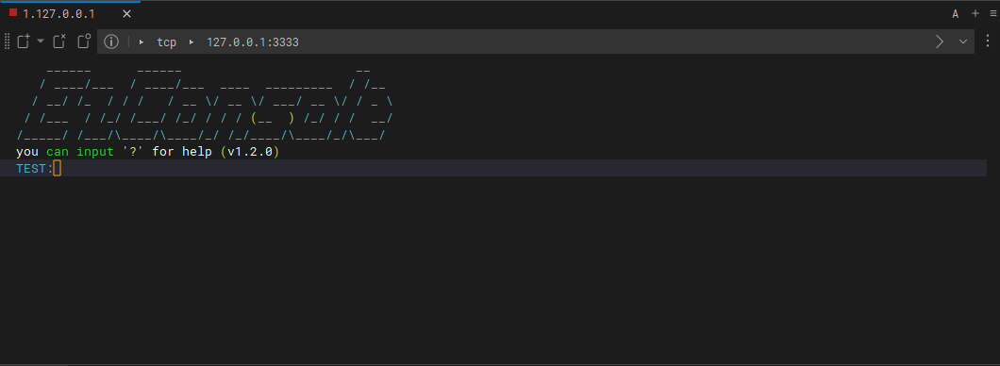

# EzCsl
EzCsl (Easy Console) is a C console that can be used for MCU terminal simulation. [简体中文](./README-zh.md)

- [EzCsl](#ezcsl)
  * [Feature](#feature)
    + [Welcome](#welcome)
    + [Autocomplete](#autocomplete)
    + [Ymodem transfers](#ymodem-transfers)
    + [Optional password simulation](#optional-password-simulation)
  * [Porting](#porting)
  * [Tutorial](#tutorial)
    + [Usage Process](#usage-process)
    + [Command Unit](#command-unit)
    + [Parameter Description](#parameter-description)
    + [Ymodem](#ymodem)
    + [Log Module](#log-module)
    + [Macro Configuration](#macro-configuration)
  * [Example](#example)
    + [How to run example in TCP mode](#how-to-run-example-in-tcp-mode)
    + [How to run example in cmd mode](#how-to-run-example-in-cmd-mode)
  * [How to make a welcome message?](#how-to-make-a-welcome-message-)
  * [TODO](#todo)


## Feature
> TCP Example 
### Welcome


### Autocomplete


### Ymodem transfers


### Optional password simulation



## Porting
1. Copy the files under `src` to your project.
2. Modify the `ezcsl_port.c` file, adding your own implementation of `ezport_receive_a_char` (for receiving characters, it is recommended to use MCU interrupt reception).
3. Modify the `ezcsl_port.c` file, adding your own implementation of `ezport_send_str` (for sending strings, it is recommended to use MCU blocking send).
4. Completion.


## Tutorial
### Usage Process
1. Call `ezcsl_init` for initialization.
2. Call `ezcsl_cmd_unit_create` to create a cmd unit (the first command).
3. Call `ezcsl_cmd_register` to create your cmd (the second command).
4. Call `ezcsl_tick` within a loop.
5. Call `ezcsl_deinit` before system shutting down.

The main code for simply creating a test command unit, the complete code is in `example/main.c`:

```c
ez_cmd_ret_t test_cmd_callback(uint16_t id, ez_param_t *para)
{
    switch (id) {
    case TEST_ADD2_ID:
        EZ_PRTL("result is %d\r\n", EZ_PtoI(para[0]) + EZ_PtoI(para[1]));
        break;
    case TEST_ADD3_ID:
        EZ_PRTL("result is %d\r\n", EZ_PtoI(para[0]) + EZ_PtoI(para[1]) + EZ_PtoI(para[2]));
        break;
    default:
        break;
    }
    return CMD_FINISH;
}


int main(void){
    ezcsl_init();
    ez_cmd_unit_t *test_unit = ezcsl_cmd_unit_create("test", "add test callback", 0, test_cmd_callback);
    ezcsl_cmd_register(test_unit, TEST_ADD2_ID, "add2", "add,a,b", "ii");
    ezcsl_cmd_register(test_unit, TEST_ADD3_ID, "add3", "add,a,b,c", "iii");

    while (!ezcsl_tick())
        ;
    ezcsl_deinit();
}
```

### Command Unit
A command unit is equivalent to a collection of commands, such as `AT,cmd1`, `AT,cmd2`... all belong to the AT command unit. Each command unit has a callback function, and all calls to commands will go through this callback function of its belonging unit (distinguished by custom ID).

> The above function calls can be referenced in the test command unit and echo command unit in example/main.c.

### Parameter Description
i: integer
f: floating point number
s: string

### Ymodem
Set the Ymodem file reception instruction header and callback function using ezcsl_modem_set. When the EzCsl terminal receives a file, it will call this callback function, where the first data frame sent contains the file transfer information. A receive buffer pointer value of NULL indicates the end of transmission.

> Ymodem transfer can be referenced in the handling method in example/main.c.

### Log Module
EZ_LOGE: log error information
EZ_LOGD: log debug information
EZ_LOGI: log informative messages
EZ_LOGV: log normal information
EZ_PRTL: print a line of information
EZ_PRT: equivalent to printf

### Macro Configuration
| Macro | Meaning |
| --- | --- |
| CSL_BUF_LEN | Terminal buffer size, which is the maximum number of characters that the terminal can input |
| HISTORY_BUF_LEN | History buffer size |
| PRINT_BUF_LEN | Printf buffer size |
| PARA_LEN_MAX | Maximum number of parameters |
| SPLIT_CHAR | Split Character |
| LOG_DEFINE | Enable/Disable log level by macro |
| USE_EZ_MODEM | Choose MODEM (EZ_NO_MODEM or EZ_YMODEM_1K) |

## Example
The example can work on Windows.

### How to run example in TCP mode
1. Clone this repo.
2. CD into this repo.
3. `gcc ./example/*.c ./src/*.c -Iexample -Isrc -lws2_32 -DTCP_MODE -o example`
4. Run `example(.exe)`.
5. Connect to `localhost:3333` using Putty, Windterm, etc.


### How to run example in cmd mode
1. Clone this repo.
2. CD into this repo.
3. `gcc ./example/*.c ./src/*.c -Iexample -Isrc -lws2_32 -DCMD_MODE -o example`
4. Run `example(.exe)` in a terminal with ANSI support (like VSCode terminal).

## How to make a welcome message?
[Text to ASCII Art Generator](https://patorjk.com/software/taag/)

## TODO
(Add more TODO items here)